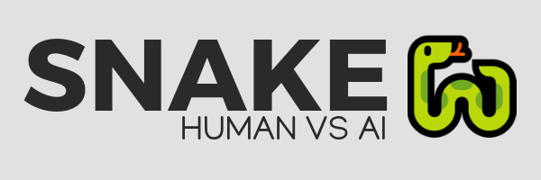

snake-on-pygame
=================

[](https://github.com/Neves4/snake-rl/graphs/commit-activity) [](https://www.python.org/) [](https://lbesson.mit-license.org/) [](https://GitHub.com/Neves4/ama)

<p align="center">
    
</p>

Snake game that can be controlled by human input and AI agents (DQN). Who's best? :snake: :robot:

Table of Contents
=================

* [1. Getting Started (for human players)](#getting_started-human)
    * [1.1. Prerequisites](#pre-req-human)
    * [1.2. Installing](#installing-human)
    * [1.3. Playing](#playing-human)
* [2. Getting Started (using AI agents)](#getting_started-ai)
    * [2.1. Available methods to integrate with any agent](#available-method)
        * [2.1.1. Methods](#methods)
        * [2.1.2. Example usage](#example-usage)
    * [2.2. Using colab-rl](#using-colab-rl)
* [3. Contributing](#contributing)
* [4. License](#license)
* [5. Acknowledgments](#acknowledgments)

## 1. Getting Started (for human players) <a name="getting-started-human"></a>

Let's get the game up and running on your computer, with the instructions below.
You can play the game and compare to the repos benchmark, which includes AI and
humans (you can include yourself by a pull request - WIP).

### 1.1. Prerequisites <a name="pre-req-human"></a>

To play the game you need Python 3.4+. If you installed [Anaconda](https://www.anaconda.com/) the only package
you need to download is pygame. Before installing it, make sure your Anaconda
installation is up-to-date using the command (conda update conda anaconda)and
updating all packages (conda update --all). To install pygame, use:

```
$ conda install -c cogsci pygame

```
It's highly recommended to use Anaconda to manage your Python packages and environments.
If you chose not to, make sure you run requirements_human.txt, using:

```
$ pip3 install -r requirements_human.txt
```

### 1.2. Installing <a name="installing-human"></a>

You can download download the source code or clone the repository to your computer.

To clone the repository, open bash or command prompt, cd to the chosen directory
and run the following code:

```
$ git clone https://github.com/Neves4/SnakeAI.git
```

To download the repo, just follow along the gif (click 'Clone or Download' and
then 'Download ZIP').


### 1.3. Playing <a name="playing-human"></a>

The GUI allows you to choose between single games and the benchmark mode. It's
also possible to choose between difficulty levels.

If using the repository files, change directory to the root, then to the game folder
and use:

```
$ python snake.py [-h]
```

An example gameplay for a single player match is shown below.

<p align="center">
    
</p>

In the benchmark mode, you will play through 10 games and your mean score/steps
are going to be recorded and you can add to the leaderboards. Pull request
changing the benchmark file ([located in here](resources/scores.json)) or open an issue with your score.

## 2. Getting Started (using AI agents) <a name="getting-started-ai"></a>

This game uses similar usage structure and methods to [OpenAI's gym](https://github.com/openai/gym) and you
can easily integrate it with any agent, written in Pytorch, Tensorflow, Theano or Keras.

It's recommended that you use [colab-rl](https://github.com/Neves4/colab-rl), a repository that integrates
state-of-the-art algorithms with games, because it already implements the agents
and the game, making the process of quick prototyping much easier.

### 2.1. Available methods to integrate with any agent <a name="available-methods"></a>

In this section, we're going to show the useful methods and properties and also
demonstrate how to use in a real case

#### 2.1.1. Methods and useful properties <a name="methods"></a>

Below are listed some useful properties of the game class.

```
>>> print(game.nb_actions)
5 # number of actions.

>>> print(game.food_pos)
(6, 5) # current position of food.

>>> print(game.steps)
10 # current number of steps in a given episode.

>>> print(game.snake.length)
4 # current length of the snake in a given episode.
```

The methods you could use to integrate with any AI agent are:

```
>>> state = game.reset()
  # Reset the game and returns the game state right after resetting.

>>> state = game.state()
  # Get the current game state.

>>> game.food_pos = game.generate_food()
  # Update the food position.

>>> state, reward, done, info = game.step(numerical_action)
  # Play a numerical_action, obtaining state, reward, over and info.

>>> game.render()
  # Render the game in a pygame window.
```

#### 2.1.2. Example usage <a name="example-usage"></a>

To use with AI agents, you need to integrate the game with the AI agent. An
example usage is:

```
from snake-on-pygame import Game
from ai_agent import your_model # import your AI agent of choice

game = Game(player = "ROBOT",
                board_size = board_size,
                local_state = local_state,
                relative_pos = RELATIVE_POS)
state = game.reset()

model = your_model()

while not game.game_over:  # Main loop, until game_over
    game.food_pos = game.generate_food()

    model.choose_action(state)   # CHOOSE ACTION BASED ON MODEL/AI AGENT
    state, reward, done, info = game.step(action)

    mode.train(state, reward, game_over, done)
    print(info)

model.test()
```

The above code is an example usage for one episode. If you want more episodes,
wrap the while loop in a loop for nb_epochs (you choose).

### 2.2. Using with colab-rl <a name="using-colab-rl"></a>

Using snake-on-pygame with [colab-rl (click here)](https://github.com/Neves4/colab-rl) is very straightforward
and you can also experiment with hyperparameters on state-of-the-art algorithms.

A detailed usage is described on the repo's main README, but for short, after
cloning it you can just execute the run_dqn.py script with:

```
$ python run_dqn.py [-h]
```

And you can read more about all the possible arguments in the file/repo. An
trained DQN model, on a 10 x 10 board with no customization is represented on the
below GIF.

<p align="center">
    
</p>

## 3. Contributing <a name="contributing"></a>

Please read [CONTRIBUTING.md](https://gist.github.com/PurpleBooth/b24679402957c63ec426) for details on this repo's code of conduct, and the process for submitting pull requests.

## 4. License <a name="license"></a>

This project is licensed under the MIT License - see the [LICENSE](LICENSE) file for details.

## 5. Acknowledgments <a name="acknowledgments"></a>

* @farizrahman4u - For his [qlearning4k](https://github.com/farizrahman4u/qlearning4k) snake code, I used it as the base of this repo's code.

* @chuyangliu - Also for his snake code, which implemented the relative actions.
